# Hands-on Kubernetes-04 : Kubernetes Volumes 

Purpose of this hands-on training is to give students the knowledge of Kubernetes Volumes.

## Learning Outcomes

At the end of the this hands-on training, students will be able to;

- Explain the need for persistent data management.

- Learn `Persistent Volumes` and `Persistent Volume Claims`.

## Outline

- Part 1 - Setting up the Kubernetes Cluster

- Part 2 - Kubernetes Volume Persistence

- Part 3 - Binding PV to PVC

- Part 4 - EmptyDir

## Part 1 - Setting up the Kubernetes Cluster

- Launch a Kubernetes Cluster of Ubuntu 20.04 with two nodes (one master, one worker) using the [Cloudformation Template to Create Kubernetes Cluster](../kubernetes-02-basic-operations/cfn-template-to-create-k8s-cluster.yml). *Note: Once the master node up and running, worker node automatically joins the cluster.*

>*Note: If you have problem with kubernetes cluster, you can use this link for lesson.*
>https://killercoda.com/playgrounds

- .bashrc file

```bash
alias k=kubectl
```

- Check if Kubernetes is running and nodes are ready.

```bash
kubectl cluster-info
kubectl get no
```

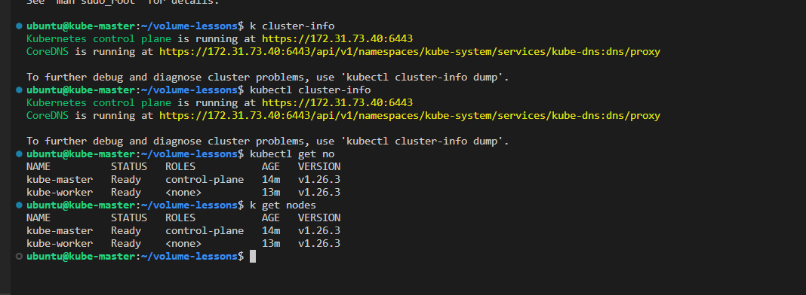

## Part 2 - Kubernetes Volume Persistence

- Get the documentation of `PersistentVolume` and its fields. Explain the volumes, types of volumes in Kubernetes and how it differs from the Docker volumes. [Volumes in Kubernetes](https://kubernetes.io/docs/concepts/storage/volumes/)

```bash
kubectl explain pv
```

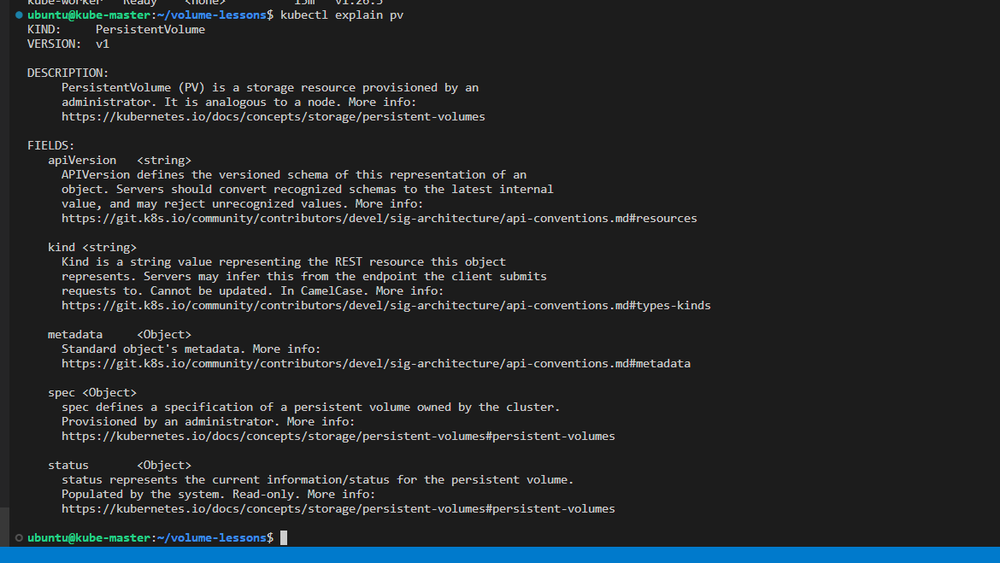

- Log into the `kube-worker-1` node, create a `pv-data` directory under home folder, also create an `index.html` file with `Welcome to Kubernetes persistence volume lesson` text and note down path of the `pv-data` folder.

```bash
mkdir pv-data && cd pv-data
echo "Welcome to Kubernetes persistence volume lesson" > index.html
ls
pwd
/home/ubuntu/pv-data
```

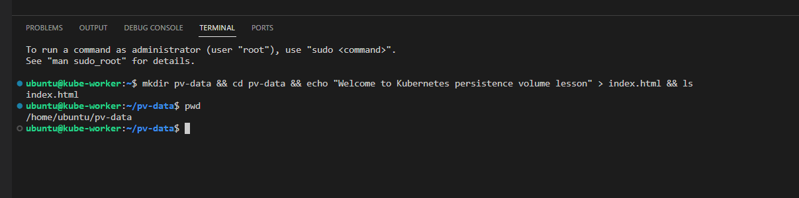

- Log into `kube-master` node and create a folder named volume-lessons.

```bash
mkdir volume-lessons && cd volume-lessons
```

- Create a `knnklc-pv.yaml` file using the following content with the volume type of `hostPath` to build a `PersistentVolume` and explain fields.

```yaml
apiVersion: v1
kind: PersistentVolume
metadata:
  name: knnklc-pv-vol
  labels:
    type: local
spec:
  storageClassName: manual
  capacity:
    storage: 5Gi
  accessModes:
    - ReadWriteOnce
  hostPath:
    path: "/home/ubuntu/pv-data"
```

- Create the PersistentVolume `knnklc-pv-vol`.

```bash
kubectl apply -f knnklc-pv.yaml
```

- View information about the `PersistentVolume` and notice that the `PersistentVolume` has a `STATUS` of available which means it has not been bound yet to a `PersistentVolumeClaim`.

```bash
kubectl get pv knnklc-pv-vol
```

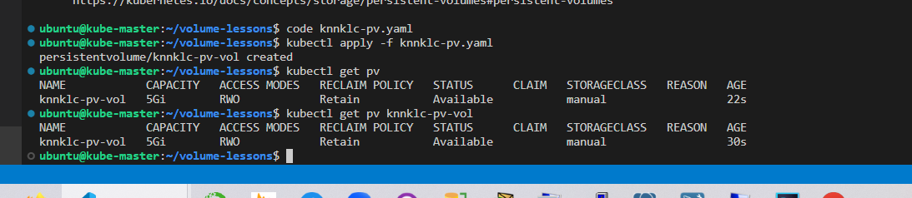

- Get the documentation of `PersistentVolumeClaim` and its fields.

```bash
kubectl explain pvc
```

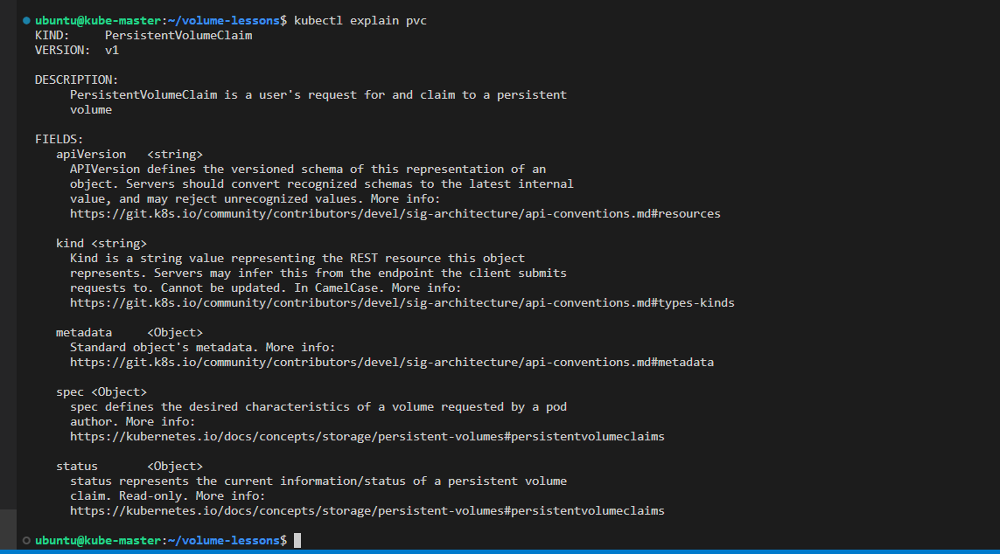

- Create a `knnklc-pv-claim.yaml` file using the following content to create a `PersistentVolumeClaim` and explain fields.

```yaml
apiVersion: v1
kind: PersistentVolumeClaim
metadata:
  name: knnklc-pv-claim
spec:
  storageClassName: manual
  accessModes:
    - ReadWriteOnce
  resources:
    requests:
      storage: 5Gi
```

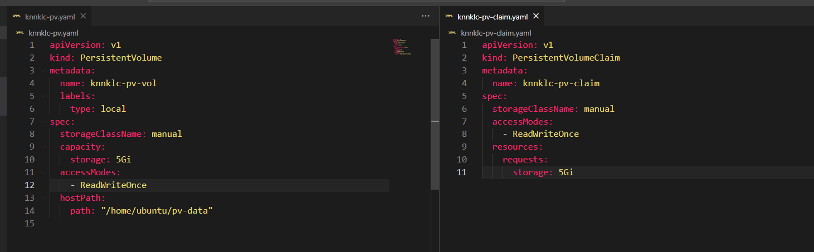

- Create the PersistentVolumeClaim `knnklc-pv-claim`.

```bash
kubectl apply -f knnklc-pv-claim.yaml
```

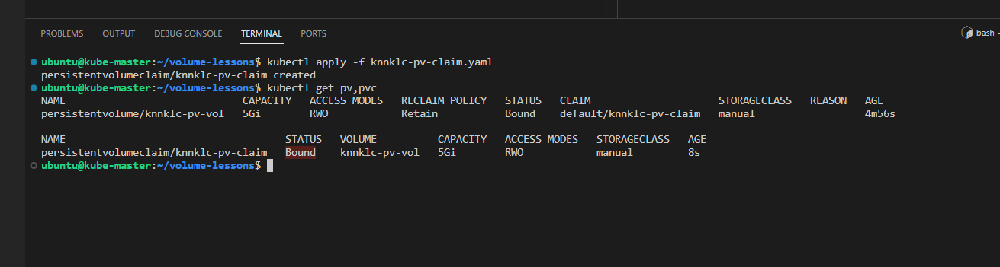

> After we create the PersistentVolumeClaim, the Kubernetes control plane looks for a PersistentVolume that satisfies the claim's requirements. If the control plane finds a suitable `PersistentVolume` with the same `StorageClass`, it binds the claim to the volume. Look for details at [Persistent Volumes and Claims](https://kubernetes.io/docs/concepts/storage/persistent-volumes/#introduction)

- View information about the `PersistentVolumeClaim` and show that the `PersistentVolumeClaim` is bound to your PersistentVolume `knnklc-pv-vol`.

```bash
kubectl get pvc knnklc-pv-claim
```

- View information about the `PersistentVolume` and show that the PersistentVolume `STATUS` changed from Available to `Bound`.

```bash
kubectl get pv knnklc-pv-vol
```

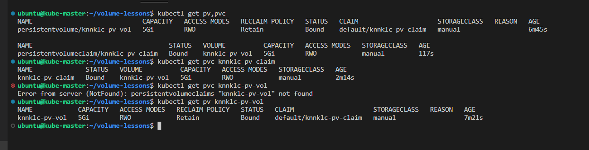

- Create a `knnklc-pod.yaml` file that uses your PersistentVolumeClaim as a volume using the following content.

```yaml
apiVersion: v1
kind: Pod
metadata:
  name: knnklc-pod
  labels:
    app: knnklc-web 
spec:
  volumes:
    - name: knnklc-pv-storage
      persistentVolumeClaim:
        claimName: knnklc-pv-claim # pvc için metadata vermiş olduğumuz name 'i yazıyoruz.
  containers:
    - name: knnklc-pv-container
      image: nginx
      ports:
        - containerPort: 80
          name: "http-server"
      volumeMounts:
        - mountPath: "/usr/share/nginx/html"
          name: knnklc-pv-storage
```

- Create the Pod `knnklc-pod`.

```bash
kubectl apply -f knnklc-pod.yaml
```

- Verify that the Pod is running.

```bash
kubectl get pod knnklc-pod
```

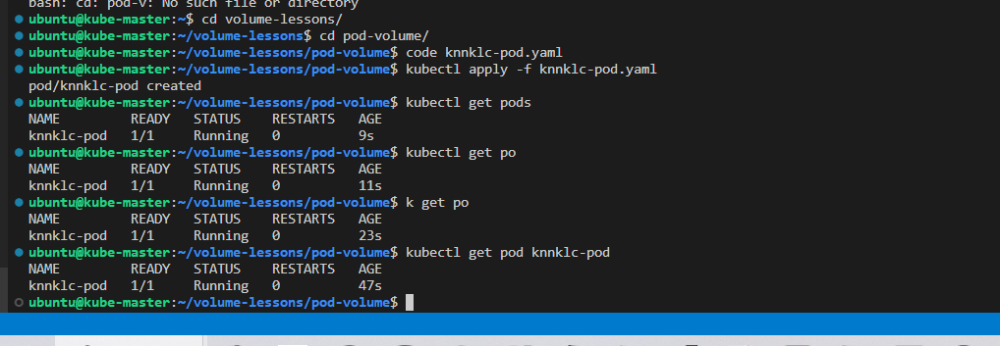

- Open a shell to the container running in your Pod.

```bash
kubectl exec -it knnklc-pod -- /bin/bash
```

- Verify that `nginx` is serving the `index.html` file from the `hostPath` volume.

```bash
curl http://localhost/
```

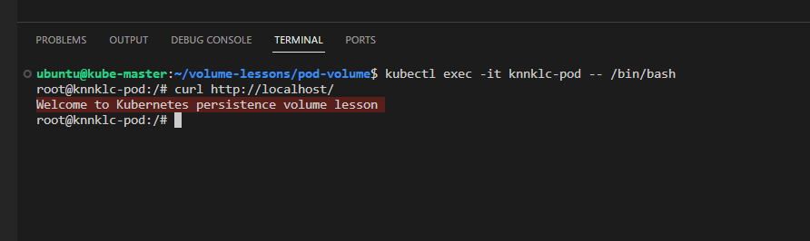

- Log into the `kube-worker-1` node, change the `index.html`.

```bash
cd pv-data
echo "Kubernetes Rocks!!!!" > index.html
```

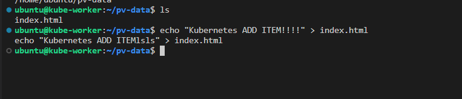
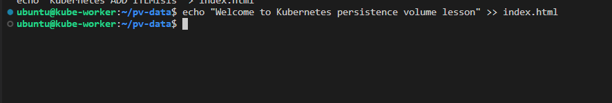

- Log into the `kube-master` node, check if the change is in effect.

```bash
kubectl exec -it knnklc-pod -- /bin/bash
curl http://localhost/
```

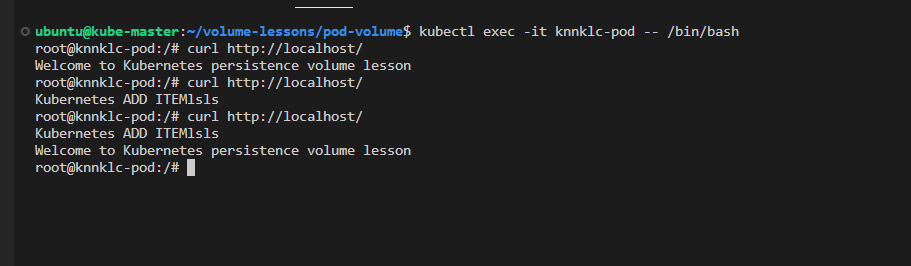

- Expose the techpro-pod pod as a new Kubernetes service on master.

```bash
kubectl expose pod knnklc-pod --port=80 --type=NodePort
```

- List the services.

```bash
kubectl get svc
```

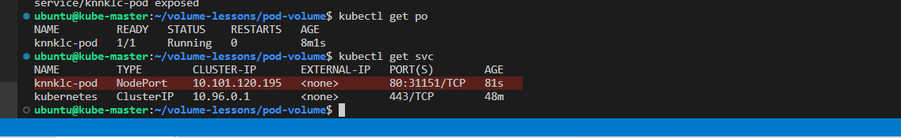

- Check the browser (`http://<public-workerNode-ip>:<node-port>`) that techpro-pod is running.
  
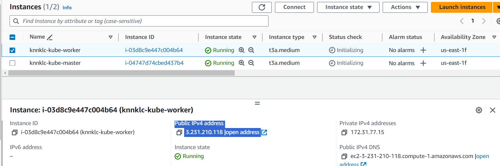

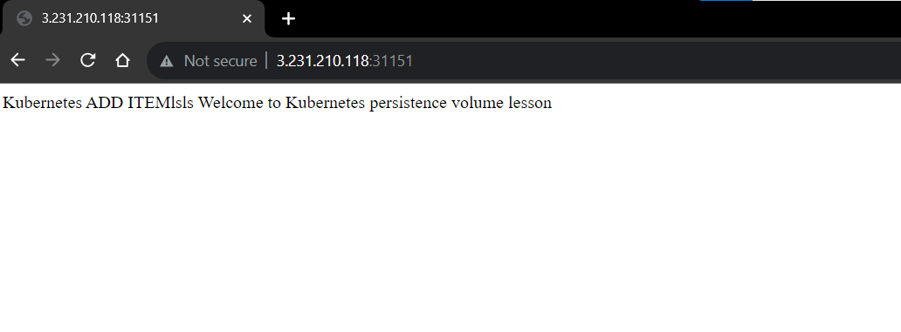

- Delete the `Pod`, the `PersistentVolumeClaim` and the `PersistentVolume`.

```bash
kubectl delete pod knnklc-pod
kubectl delete pvc knnklc-pv-claim
kubectl delete pv knnklc-pv-vol
```

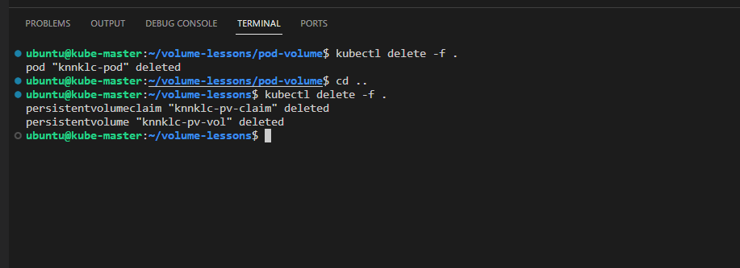

## Part 3 - Binding PV to PVC

- Create a folder and name it "pvc-bound".

```bash
mkdir pvc-bound && cd pvc-bound
```

- Create a `pv-3g.yaml` file using the following content with the volume type of `hostPath` to build a `PersistentVolume`.

```yaml
apiVersion: v1
kind: PersistentVolume
metadata:
  name: pv-3g
  labels:
    type: local
spec:
  storageClassName: manual
  capacity:
    storage: 3Gi
  accessModes:
    - ReadWriteOnce
  hostPath:
    path: "/home/ubuntu/pv-data"
```

- Create the PersistentVolume `pv-3g`.

```bash
kubectl apply -f pv-3g.yaml
```

- Create a `pv-6g.yaml` file using the following content with the volume type of `hostPath` to build a `PersistentVolume`.

```yaml
apiVersion: v1
kind: PersistentVolume
metadata:
  name: pv-6g
  labels:
    type: local
spec:
  storageClassName: manual
  capacity:
    storage: 6Gi
  accessModes:
    - ReadWriteOnce
  hostPath:
    path: "/home/ubuntu/pv-data"
```

- Create the PersistentVolume `pv-6g`.

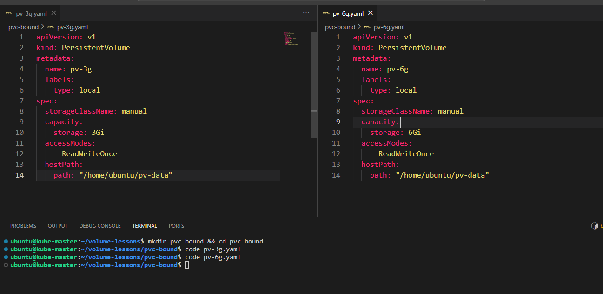

```bash
kubectl apply -f pv-6g.yaml
```

- List to PersistentVolume's.

```bash
kubectl get pv
```

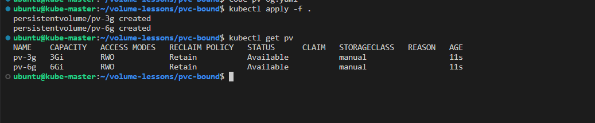

- Create a `pv-claim-2g.yaml` file using the following content to create a `PersistentVolumeClaim`.

```yaml
apiVersion: v1
kind: PersistentVolumeClaim
metadata:
  name: pv-claim-2g
spec:
  storageClassName: manual
  accessModes:
    - ReadWriteOnce
  resources:
    requests:
      storage: 2Gi
```

- Create the PersistentVolumeClaim `pv-claim-2g`.

```bash
kubectl apply -f pv-claim-2g.yaml
```

- View information about the `PersistentVolumeClaim` and show that the `pv-claim-2g` is bound to PersistentVolume `pv-3g`. Notice that the capacity of the pv-claim-2g is 3Gi.

```bash
kubectl get pvc
```

- Create another PersistentVolumeClaim file and name it `pv-claim-7g.yaml`.

```yaml
apiVersion: v1
kind: PersistentVolumeClaim
metadata:
  name: pv-claim-7g
spec:
  storageClassName: manual
  accessModes:
    - ReadWriteOnce
  resources:
    requests:
      storage: 7Gi
```

- Create the PersistentVolumeClaim `pv-claim-7g`.
  
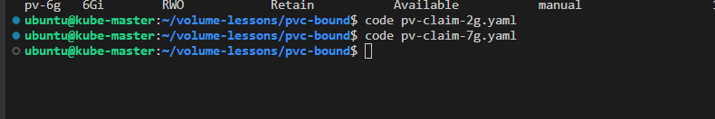

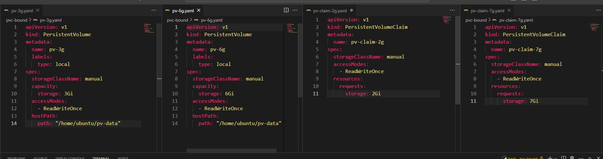

```bash
kubectl apply -f pv-claim-7g.yaml
```

- View information about the `PersistentVolume's` and `PersistentVolumeClaim's` and show that the status of `pv-claim-7g` is `pending` and the satus of pv-6g is available.

```bash
kubectl get pv,pvc
```

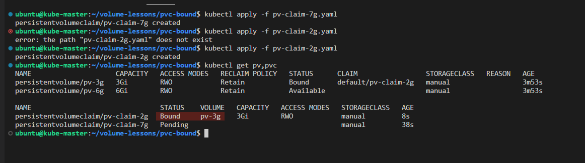

- Delete all pv and pvc's.

```bash
kubectl delete -f .
```

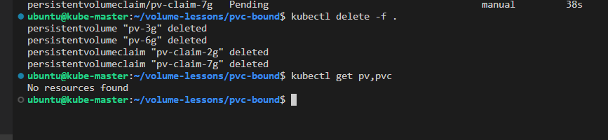

## Part 4 - EmptyDir

- An `emptyDir volume` is first created when a Pod is assigned to a node, and exists as long as that Pod is running on that node. 
- As the name says, the emptyDir volume is initially empty.
- When a Pod is removed from a node for any reason, the data in the emptyDir is deleted permanently.

> Note : A container crashing does not remove a Pod from a node. The data in an emptyDir volume is safe across container crashes.

- Create a folder name it emptydir.

```bash
mkdir emptydir && cd emptydir
```

- Create an `nginx.yaml` file for creating an nginx pod.

```yaml
apiVersion: v1
kind: Pod
metadata:
  name: nginx-pod
  labels:
    app: nginx
spec:
  containers:
  - name: mynginx
    image: nginx:1.19
    ports:
    - containerPort: 80
    volumeMounts:
      - mountPath: /test
        name:  emptydir-test
  volumes:
  - name: emptydir-test
    emptyDir: {}
```

- create the nginx-pod.

```bash
kubectl apply -f nginx.yaml 
```

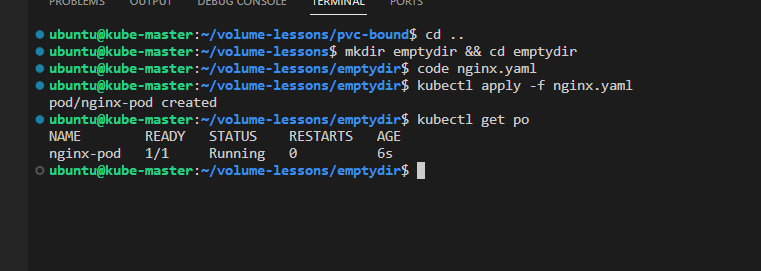

- Log in the nginx-pod and notice that there is a test folder.

```bash
kubectl exec -it nginx-pod -- bash
root@nginx-pod:/# ls
bin   dev                  docker-entrypoint.sh  home  lib64  mnt  proc  run   srv  test  usr
boot  docker-entrypoint.d  etc                   lib   media  opt  root  sbin  sys  tmp   var
```

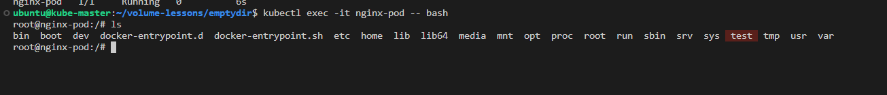

- Create a text file in test folder.

```bash
root@nginx-pod:/# cd test
root@nginx-pod:/test# echo "Hello World" > hello.txt 
root@nginx-pod:/test# cat hello.txt 
Hello World
```

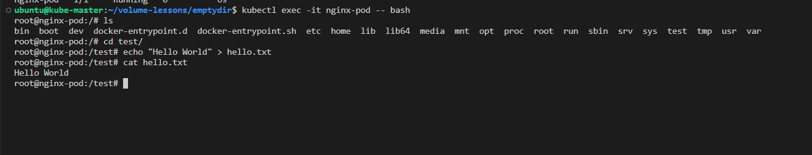

- Log in the `kube-worker-1 ec2-instance` and remove the `nginx container`. Note that container is changed.

- See the running containers
  
```bash
sudo ctr --namespace k8s.io containers ls 
```

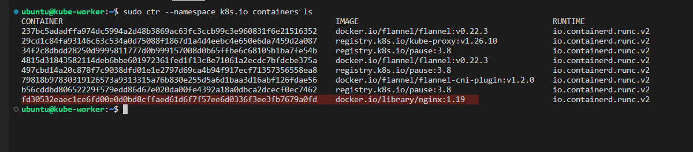

- Stop the running containers

```bash
sudo ctr --namespace k8s.io tasks rm -f <container-id>  
```

- Delete the running containers

```bash
sudo ctr --namespace k8s.io containers delete <container-id>  
```

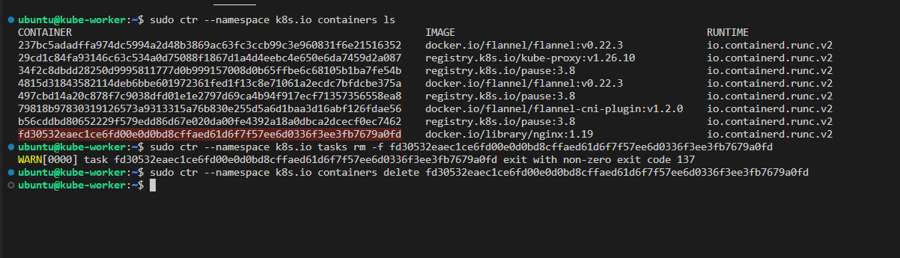

- Log in the kube-master ec2-instance again and connect the nginx-pod. See that test folder and content are there.

```bash
kubectl exec -it nginx-pod -- bash
root@nginx-pod:/# ls
bin   dev                  docker-entrypoint.sh  home  lib64  mnt  proc  run   srv  test  usr
boot  docker-entrypoint.d  etc                   lib   media  opt  root  sbin  sys  tmp   var
root@nginx-pod:/# cd test/
root@nginx-pod:/test# cat hello.txt 
Hello World
```

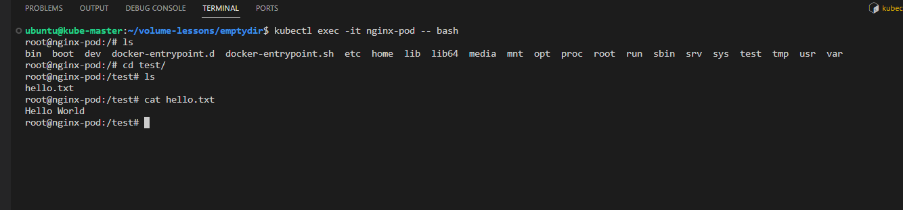

- Delete the pod.

```bash
kubectl delete pod nginx-pod
```

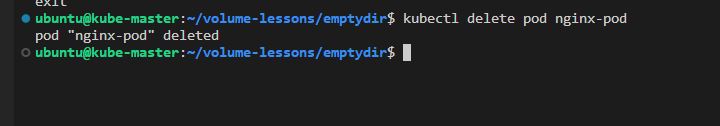
