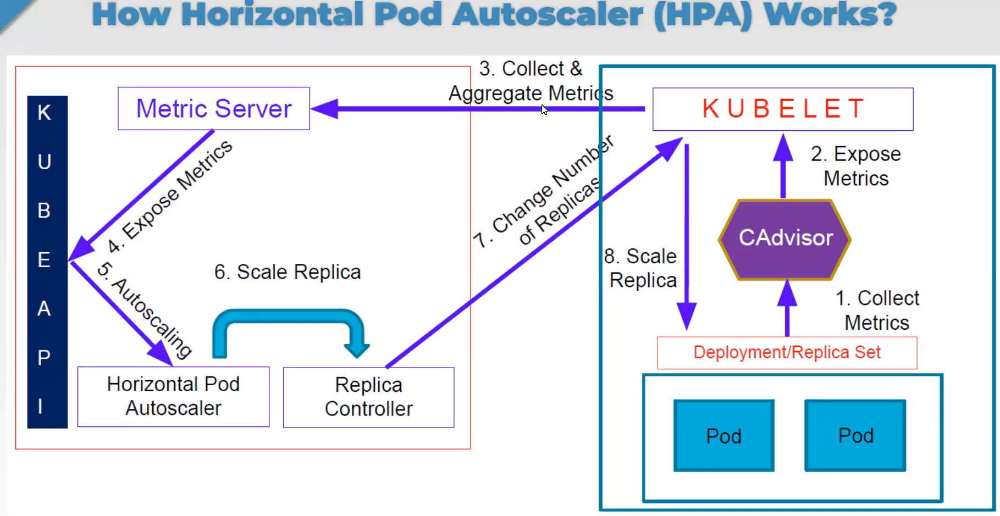

# Hands-on Kubernetes-06 : Deploying Microservices and Service Level Autoscaling

Purpose of the this hands-on training is to give students the knowledge of  Autoscaling and Microservices

## Learning Outcomes

At the end of the this hands-on training, students will be able to;

- Understand deployment and management of microservices

- Explain the Kubernetes Autoscaling

- Explain Horizontal Pod Autoscaler Business Logic

- Understand the Need for Metric Server

## Outline

- Part 1 - Setting up the Kubernetes Cluster

- Part 2 - Outline of the Hands-on Setup

- Part 3 - Microservices

- Part 4 - Autoscaling in Kubernetes

## Part 1 - Setting up the Kubernetes Cluster

- Launch a Kubernetes Cluster of Ubuntu 20.04 with two nodes (one master, one worker) using the [Cloudformation Template to Create Kubernetes Cluster](../kubernetes-02-basic-operations/cfn-template-to-create-k8s-cluster.yml). *Note: Once the master node up and running, worker node automatically joins the cluster.*

>*Note: If you have problem with kubernetes cluster, you can use this link for lesson.*
><https://killercoda.com/playgrounds>

- Check if Kubernetes is running and nodes are ready.

```bash
kubectl cluster-info
kubectl get no
```

## Part 2 - Outline of the Hands-on Setup

- Scenario


- In this study, we will present an application that contains 2 unrelated sub-application.

- First one is simple web&database application to hold the to-do-lists. This sub-application uses MongoDB to store to-do lists created through the web application. For the front-end web application layer, Node.JS is used. Thus, this sub-aplication has 2 microservices.
  
- Second one is used to demonstrate Horizontal Pod Autoscaler fuctionality based on the php-apache image.

- Create a `microservices` directory and `to-do` directory in the microservices directory and change directory.

```bash
mkdir microservices
cd microservices
mkdir to-do
cd to-do
```


### Steps of execution

1. We will deploy the `to-do` app first and look at some key points.
2. And then deploy the `php-apache` app and highligts some important points.
3. The Autoscaling in Kubernetes will be  demonstrated as a last step.

## Part 3 - Microservices

- The MongoDB application will use a static volume provisioning with the help of persistent volume (PV) and persistent volume claim (PVC).

- Create a `db-pv.yaml` file.

```yaml
apiVersion: v1
kind: PersistentVolume  # tür olarak bir persistenvolume oluşturuyoruz 
metadata:
  name: db-pv-vol      # ve oluşturduğumuz persistenvolume 'un name' ini belirliyoruz.
  labels:
    type: local
spec:
  storageClassName: manual
  capacity:
    storage: 5Gi
  accessModes:
    - ReadWriteOnce   # Okuma yazma işlemi için bir poda bağlanır veya yetki verir
  hostPath:
    path: "/home/ubuntu/pv-data"  # makine içinde yani worker node'un içinde böyle bir alan bize ayırıyor. ("/home/ubuntu/pv-data")
```

- Create a `db-pvc.yaml` file.

```yaml
apiVersion: v1
kind: PersistentVolumeClaim
metadata:
  name: database-persistent-volume-claim
spec:
  accessModes:
    - ReadWriteOnce 
  storageClassName: manual
  resources:
    requests:
      storage: 1Gi
```


- It will provision storage from `hostpath`.

- Let's create the MongoDB deployment yaml file (name it `db-deployment.yaml`) to see how the PVC is used.

```yaml
apiVersion: apps/v1
kind: Deployment        # yapacağımız işlem deployment o yüzden deployment yazıyoruz
metadata:
  name: db-deployment   # oluşturacağımız deploymentin adını veriyoruz.
  labels:
    app: todoapp
spec:
  replicas: 1 # 1 tane (1 tane pod oluşturacak) replicaset oluşturmak istiyoruz. Yani database için 1 tane pod oluştursun istiyoruz.
  selector:
    matchLabels:
      name: mongo  # 1 Bu iki kısım birbirleriyle aynı olmalıdır ki birbiriyle match ( repliacset <--> pod ) olsun 
  template:
    metadata:
      labels:
        name: mongo  # 1 Bu iki kısım birbirleriyle aynı olmalıdır ki birbiriyle match ( repliacset <--> pod ) olsun 
        app: todoapp
    spec:
      containers:
      - image: mongo:5.0
        name: mongo
        ports:
        - containerPort: 27017
        volumeMounts:
          - name: mongo-storage
            mountPath: /data/db  # 
      volumes:
        #- name: mongo-storage
        #  hostPath:
        #    path: /home/ubuntu/pv-data
        - name: mongo-storage
          persistentVolumeClaim:
            claimName: database-persistent-volume-claim
```

```text
Bu YAML kodu, bir Kubernetes Deployment kaynağı tanımlar ve bir MongoDB konteynerinin dağıtımını ifade eder. Aşağıda bu kodun ana bileşenlerini açıklayan bir özet bulunmaktadır:

apiVersion: Bu, bu kaynağın kullanacağı Kubernetes API sürümünü belirtir. Burada "apps/v1" olarak ayarlanmıştır, bu da Deployments için kullanılan API sürümüdür.

kind: Kubernetes kaynağının türünü tanımlar; bu durumda "Deployment" türündedir.

metadata: Deployments hakkında bilgi içeren kısım, bu kısım Deployment'ın adını ve etiketlerini içerir.

name: Deployment'ın adı "db-deployment" olarak belirlenmiştir.
labels: Etiketler, kaynakları tanımlamak ve kategorilendirmek için kullanılır. Bu Deployment "app: todoapp" etiketine sahiptir.
spec: Deployment'ın istenen durumunu belirtir.

replicas: Bu alan 1 olarak ayarlanmıştır, bu da MongoDB konteynerinin 1 adet replikasının (pod) korunmasını belirtir.

selector: Deployment'ın yöneteceği podları seçme yöntemini açıklar.

matchLabels: Deployment, "name: mongo" etiketini taşıyan podları yönetir.
template: Deployment tarafından oluşturulan podlar için şablonu tanımlar.

metadata: Bu şablondan oluşturulan podlara uygulanacak etiketleri belirtir. Etiketler "name: mongo" ve "app: todoapp" olarak belirlenmiştir.

spec: Pod'un yapılandırmasını tanımlar.

containers: Pod içinde çalıştırılacak konteynerleri açıklar. Bu, aşağıdaki özelliklere sahip bir konteyner içerir:

image: Konteyner, "mongo:5.0" imajını kullanır, bu da MongoDB'nin 5.0 sürümüdür.
name: Konteynerin adı "mongo" olarak belirlenmiştir.
ports: Konteyner içindeki 27017 numaralı bağlantı noktasını açar.
volumeMounts: Konteyner içindeki hangi bölgelere bağlantı noktalarının yapılacağını belirtir. Burada "mongo-storage" adında bir bağlantı noktası adı belirtilir ve bu bağlantı noktası konteyner içinde "/data/db" yoluna bağlanır.

volumes: Pod içinde kullanılabilecek bölgeleri tanımlar. İki bölgelik tanım sağlanmıştır (biri açıklamalı). Yorum yapılmayan bölüm, "mongo-storage" adında bir bölgeyi "database-persistent-volume-claim" adındaki bir Kalıcı Bölge Talebi (PVC) ile ilişkilendirir.

Bu Deployment'ın temel amacı, belirtilen yapılandırmaya sahip bir MongoDB konteynerini (replika) yönetmektir. Konteyneri, verilerin "database-persistent-volume-claim" adındaki bir Kalıcı Bölge Talebi (PVC) ile kalıcı olarak saklandığı bir depolama bölgesiyle ilişkilendirir. Ancak bunu tam olarak işlevsel hale getirmek için, PVC'yi tanımlamanız ve diğer detayları, depolama sınıfı, erişim modu ve depolama kapasitesi gibi detayları Kubernetes yapılandırmanızın başka bir yerinde belirtmeniz gerekir.
```

- The commented part directly uses the local hostpath for storage. Students can try it on their own later.

- Let's create the MongoDB `service` and name it `db-service.yaml`.

```yaml
apiVersion: v1
kind: Service
metadata:
  name: db-service
  labels:
    name: mongo
    app: todoapp
spec:
  selector:
    name: mongo
  type: ClusterIP
  ports:
    - name: db
      port: 27017        # bu service ait olan porttur.
      targetPort: 27017  # bu da container'e ait olan porttur.
```

```text
Bu YAML kodu, bir Kubernetes Service kaynağını tanımlar. Aşağıda bu kodun ana bileşenlerini açıklayan bir özet bulunmaktadır:

apiVersion: Bu, bu kaynağın kullanacağı Kubernetes API sürümünü belirtir. Burada "v1" olarak ayarlanmıştır, bu da Service kaynağının v1 API sürümüdür.

kind: Kubernetes kaynağının türünü tanımlar; bu durumda "Service" türündedir.

metadata: Service hakkında bilgi içeren bölümdür. Service'ın adı ve etiketleri burada belirtilir.

name: Service'ın adı "db-service" olarak belirlenmiştir.
labels: Etiketler, kaynakları tanımlamak ve kategorilendirmek için kullanılır. Bu Service, "name: mongo" ve "app: todoapp" etiketlerine sahiptir.
spec: Service'ın özelliklerini belirtir.

selector: Service tarafından yönlendirilecek hedef podları seçer.

name: mongo: Hedef podları seçerken "name: mongo" etiketine sahip olanları hedef olarak seçer.
type: Service tipini belirtir. Burada "ClusterIP" olarak ayarlanmıştır. Bu, Service'ın yalnızca Kubernetes kümesi içinden erişilebilir olduğu anlamına gelir.

ports: Service tarafından yönlendirilen bağlantı noktalarını belirtir.

name: db: Bağlantı noktasının adı "db" olarak belirlenmiştir.
port: 27017: Service'ın dış dünyadan erişilebilir olan bu bağlantı noktasını 27017 numarasına yönlendirir.
targetPort: 27017: Hedef poddaki MongoDB konteynerinin 27017 numaralı bağlantı noktasına yönlendirilir.
Bu Service, "db-service" adı altında bir MongoDB hizmetini temsil eder. Bu Service, "name: mongo" ve "app: todoapp" etiketlerine sahip podları hedefler ve bu podlara gelen trafiği MongoDB konteynerinin 27017 numaralı bağlantı noktasına yönlendirir. Ancak bu Service yalnızca Kubernetes kümesi içinden erişilebilir, yani dış dünya ile iletişim kurmaz.
```

- Note that a database has no direct exposure the outside world, so it's type is `ClusterIP`.

- Now, create the `web-deployment.yaml` for web application.

```yaml
apiVersion: apps/v1
kind: Deployment
metadata:
  name: web-deployment
  labels:
    app: todoapp
spec:
  replicas: 1
  selector:
    matchLabels:
      name: web
  template:
    metadata:
      labels:
        name: web
        app: todoapp
    spec:
      containers: 
        - image: techprodevops348/todo
          imagePullPolicy: Always
          name: myweb
          ports: 
            - containerPort: 3000
          env:
            - name: "DBHOST"
              value: db-service
          resources:
            limits:
              memory: 500Mi
              cpu: 100m
            requests:
              memory: 250Mi
              cpu: 80m 
```

- Note that this web app is connnected to MongoDB host/service via the `DBHOST` environment variable. What does `db-service:27017` mean here. How is the IP resolution handled?

- When should we use `imagePullPolicy: Always`. Explain the `image` pull policy shortly.

- This time, we create the `web-service.yaml` for front-end web application `service`.

```yaml
apiVersion: v1
kind: Service
metadata:
  name: web-service
  labels:
    name: web
    app: todoapp
spec:
  selector:
    name: web 
  type: NodePort
  ports:
   - name: http
     port: 3000   # Bu, servisin dış dünyadan erişilebilir olan bağlantı noktasını belirtir. Yani servis bu bağlantı noktası üzerinden dış dünyaya hizmet sunar.
     targetPort: 3000 # Bu, servisin arkasında çalışan hedef uygulamanın dinlediği iç bağlantı noktasını belirtir. Yani servis, bu bağlantı noktasına gelen istekleri hedef uygulamaya yönlendirir.
     nodePort: 30001  #  Bu, Kubernetes kümesinin düğümleri (node'ları) üzerinden servise erişmek için kullanılabilir olan düğüm bağlantı noktasını belirtir. Yani servise bu düğüm bağlantı noktası üzerinden erişilebilir olacaktır.
     protocol: TCP
```

- What should be the type of the service? ClusterIP, NodePort or LoadBalancer?

- Let's deploy the to-do application.

```bash
cd ..
kubectl apply -f to-do
deployment.apps/db-deployment created
persistentvolume/db-pv-vol created
persistentvolumeclaim/database-persistent-volume-claim created
service/db-service created
deployment.apps/web-deployment created
service/web-service created
```


- Note that we can use `directory` with `kubectl apply -f` command.

- Check the persistent-volume and persistent-volume-claim.

```bash
$ kubectl get pv
NAME        CAPACITY   ACCESS MODES   RECLAIM POLICY   STATUS   CLAIM                                      STORAGECLASS   REASON   AGE
db-pv-vol   5Gi        RWO            Retain           Bound    default/database-persistent-volume-claim   manual                  23s

$ kubectl get pvc
NAME                               STATUS   VOLUME      CAPACITY   ACCESS MODES   STORAGECLASS   AGE
database-persistent-volume-claim   Bound    db-pv-vol   5Gi        RWO            manual         56s
```

- Check the pods.

```bash
$ kubectl get pods
NAME                              READY   STATUS    RESTARTS   AGE
db-deployment-8597967796-q7x5s    1/1     Running   0          4m30s
web-deployment-658cc55dc8-2h2zc   1/1     Running   2          4m30s
```

- Check the services.

```bash
$ kubectl get svc
NAME          TYPE        CLUSTER-IP      EXTERNAL-IP   PORT(S)          AGE
db-service    ClusterIP   10.105.0.75     <none>        27017/TCP        4m39s
kubernetes    ClusterIP   10.96.0.1       <none>        443/TCP          2d8h
web-service   NodePort    10.107.136.54   <none>        3000:30001/TCP   4m38s
```


- Note the `PORT(S)` difference between `db-service` and `web-service`. Why?

- We can visit http://<public-node-ip>:<node-port> and access the application. Note: Do not forget to open the Port <node-port> in the security group of your node instance.

- We see the home page. You can add to-do's.


### Deploy the second aplication

- Create a `php-apache` directory and change directory.

```bash
$ pwd
/home/ubuntu/microservices
```

```bash
mkdir php-apache
cd php-apache
```

- Create a `php-apache.yaml` file for second application.

```yaml
apiVersion: apps/v1
kind: Deployment
metadata:
  name: php-apache
spec:
  selector:
    matchLabels:
      run: php-apache
  replicas: 1
  template:
    metadata:
      labels:
        run: php-apache
    spec:
      containers:
      - name: php-apache
        image: k8s.gcr.io/hpa-example
        ports:
        - containerPort: 80
        resources:
          limits:
            memory: 500Mi
            cpu: 100m
          requests:
            memory: 250Mi
            cpu: 80m
---  # Burdan sonra yeni bir işlem başlayacak anlamına geliyor.
apiVersion: v1
kind: Service
metadata:
  name: php-apache-service
  labels:
    run: php-apache
spec:
  ports:
  - port: 80
    nodePort: 30002
  selector:
    run: php-apache 
  type: NodePort 
```

Note how the `Deployment` and `Service` `yaml` files are merged in one file.

Deploy this `php-apache` file.

```bash
$ kubectl apply -f . 
deployment.apps/php-apache created
service/php-apache-service created
```


- Get the pods.

```bash
$ kubectl get po
NAME                              READY   STATUS    RESTARTS   AGE
db-deployment-8597967796-q7x5s    1/1     Running   0          17m
php-apache-7869bd4fb-xsvnh        1/1     Running   0          24s
web-deployment-658cc55dc8-2h2zc   1/1     Running   2          17m
```

- Get the services.

```bash
$ kubectl get svc
NAME                 TYPE        CLUSTER-IP      EXTERNAL-IP   PORT(S)          AGE
db-service           ClusterIP   10.105.0.75     <none>        27017/TCP        17m
kubernetes           ClusterIP   10.96.0.1       <none>        443/TCP          2d9h
php-apache-service   NodePort    10.101.242.84   <none>        80:30002/TCP     35s
web-service          NodePort    10.107.136.54   <none>        3000:30001/TCP   17m
```


- Let's check what web app presents us.

- On opening browser (http://<public-node-ip>:<node-port>) we see


```text
OK!
```

- Alternatively, you can use;

```text
curl <public-worker node-ip>:<node-port>
OK!
```


- Do not forget to open the Port <node-port> in the security group of your node instance.

## Part 4 - Autoscaling in Kubernetes

### Benefits of Autoscaling

To understand better where autoscaling would provide the most value, let’s start with an example. Imagine you have a 24/7 production service with a load that is variable in time, where it is very busy during the day in the US, and relatively low at night. Ideally, we would want the number of nodes in the cluster and the number of pods in deployment to dynamically adjust to the load to meet end user demand. The new Cluster Autoscaling feature together with Horizontal Pod Autoscaler can handle this for you automatically.

### Run & expose php-apache server  

- First, let's check the php-apache `Services` and `Pods` to see if they are still running.

- Observe pods and services:

```bash
$ kubectl get po 
$ kubectl get endpoints
NAME                              READY   STATUS    RESTARTS   AGE
db-deployment-8597967796-q7x5s    1/1     Running   0          96m
php-apache-7869bd4fb-xsvnh        1/1     Running   0          79m
web-deployment-658cc55dc8-2h2zc   1/1     Running   2          96m


$ kubectl get svc
NAME                 TYPE        CLUSTER-IP      EXTERNAL-IP   PORT(S)          AGE
db-service           ClusterIP   10.105.0.75     <none>        27017/TCP        96m
kubernetes           ClusterIP   10.96.0.1       <none>        443/TCP          2d10h
php-apache-service   NodePort    10.101.242.84   <none>        80:32748/TCP     79m
web-service          NodePort    10.107.136.54   <none>        3000:30634/TCP   96m
```


- Add `watch` board to verify the latest status of Cluster by below Commands.(This is Optional as not impacting the Functionality of Cluster). Observe in a separate terminal.

```bash
kubectl get service,hpa,pod -o wide
watch -n1 !! # or
watch -n1 kubectl get service,hpa,pod -o wide
```


### Create Horizontal Pod Autoscaler

- Scenario
  


- Now that the server is running, we will create the autoscaler using kubectl autoscale. The following command will create a Horizontal Pod Autoscaler that maintains between 2 and 10 replicas of the Pods controlled by the php-apache deployment we created in the first step of these instructions. Roughly speaking, HPA will increase and decrease the number of replicas (via the deployment) to maintain an average CPU utilization across all Pods of 50% (since each pod requests 200 milli-cores by kubectl run), this means average CPU usage of 100 milli-cores). See [here]( https://kubernetes.io/docs/tasks/run-application/horizontal-pod-autoscale/#algorithm-details ) for more details on the algorithm.

- Now activate the  HPAs manually;

```bash
kubectl autoscale deployment php-apache --cpu-percent=50 --min=2 --max=10 
kubectl autoscale deployment web-deployment --cpu-percent=50 --min=3 --max=5 
```


```bash
kubectl get autoscale --help
watch -n1 kubectl get po
watch kubectl get pod,svc    
```


- or we can use yaml files.

```bash
$ pwd
/home/ubuntu/microservices
$ mkdir auto-scaling && cd auto-scaling
$ cat << EOF > hpa-php-apache.yaml

apiVersion: autoscaling/v2
kind: HorizontalPodAutoscaler
metadata:
  name: php-apache
spec:
  scaleTargetRef:
    apiVersion: apps/v1
    kind: Deployment
    name: php-apache
  minReplicas: 2
  maxReplicas: 10
  metrics:
  - type: Resource
    resource:
      name: cpu
      target:
        type: Utilization
        averageUtilization: 50

EOF
```

```bash
$ cat << EOF > hpa-web.yaml

apiVersion: autoscaling/v2
kind: HorizontalPodAutoscaler
metadata:
  name: web-deployment
spec:
  scaleTargetRef:
    apiVersion: apps/v1
    kind: Deployment
    name: web-deployment
  minReplicas: 3
  maxReplicas: 5
  metrics:
  - type: Resource
    resource:
      name: cpu
      target:
        type: Utilization
        averageUtilization: 50

EOF
```


```bash
kubectl apply -f hpa-php-apache.yaml
kubectl apply -f hpa-web.yaml
kubectl describe service db-service
kubectl get po
```


Let's look at the status:

```bash
$ watch -n3 kubectl get service,hpa,pod -o wide 

Every 3,0s: kubectl get service,hpa,pod -o wide                                                                       ubuntu: Sat Sep 12 17:48:18 2020

NAME                         TYPE        CLUSTER-IP      EXTERNAL-IP   PORT(S)          AGE     SELECTOR
service/db-service           ClusterIP   10.105.0.75     <none>        27017/TCP        105m    name=mongo
service/kubernetes           ClusterIP   10.96.0.1       <none>        443/TCP          2d10h   <none>
service/php-apache-service   NodePort    10.101.242.84   <none>        80:30002/TCP     88m     run=php-apache
service/web-service          NodePort    10.107.136.54   <none>        3000:30001/TCP   105m    name=web

NAME                                             REFERENCE                   TARGETS         MINPODS   MAXPODS   REPLICAS   AGE
horizontalpodautoscaler.autoscaling/php-apache   Deployment/php-apache       <unknown>/50%   2         10        2          81s
horizontalpodautoscaler.autoscaling/web          Deployment/web-deployment   <unknown>/50%   3         5         3          76s

NAME                                  READY   STATUS    RESTARTS   AGE    IP           NODE       NOMINATED NODE   READINESS GATES
pod/db-deployment-8597967796-q7x5s    1/1     Running   0          105m   172.18.0.5   minikube   <none>           <none>
pod/php-apache-7869bd4fb-fgkpf        1/1     Running   0          66s    172.18.0.7   minikube   <none>           <none>
pod/php-apache-7869bd4fb-xsvnh        1/1     Running   0          88m    172.18.0.6   minikube   <none>           <none>
pod/web-deployment-658cc55dc8-2h2zc   1/1     Running   2          105m   172.18.0.4   minikube   <none>           <none>
pod/web-deployment-658cc55dc8-88nxz   1/1     Running   0          61s    172.18.0.8   minikube   <none>           <none>
pod/web-deployment-658cc55dc8-c7hdl   1/1     Running   0          61s    172.18.0.9   minikube   <none>           <none>
```


- php-apache Pod number increased to 2, minimum number.
- web-deployment Pod number increased to 3, minimum number.
- The HPA line under TARGETS shows `<unknown>/50%`. The `unknown` means the HPA can't idendify the current use of CPU.

We may check the current status of autoscaler by running:  

```bash
$ kubectl get hpa
NAME         REFERENCE                   TARGETS         MINPODS   MAXPODS   REPLICAS   AGE
php-apache   Deployment/php-apache       <unknown>/50%   2         10        2          2m4s
web          Deployment/web-deployment   <unknown>/50%   3         5         3          117s
```

```bash
$ kubectl describe hpa
....
Reference:                                             Deployment/php-apache
Metrics:                                               ( current / target )
  resource cpu on pods  (as a percentage of request):  <unknown> / 50%
....
Conditions:
  Type           Status  Reason                   Message
  ----           ------  ------                   -------
  AbleToScale    True    SucceededGetScale        the HPA controller was able to get the target's current scale
  ScalingActive  False   FailedGetResourceMetric  the HPA was unable to compute the replica count: unable to get metrics for resource cpu: **unable to fetch metrics from resource metrics API**: the server could not find the requested resource (get pods.metrics.k8s.io)

.....
Reference:                                             Deployment/web-deployment
Metrics:                                               ( current / target )
  resource cpu on pods  (as a percentage of request):  <unknown> / 50%
....
Conditions:
  Type           Status  Reason                   Message
  ----           ------  ------                   -------
  AbleToScale    True    SucceededGetScale        the HPA controller was able to get the target's current scale
  ScalingActive  False   FailedGetResourceMetric  the HPA was unable to compute the replica count: unable to get metrics for resource cpu: **unable to fetch metrics from resource metrics API:** the server could not find the requested resource (get pods.metrics.k8s.io)
.....
```

- The `metrics` can't be calculated. So, the `metrics server` should be uploaded to the cluster.
  


### Install Metric Server

- First Delete the existing Metric Server if any.

```bash
kubectl delete -n kube-system deployments.apps metrics-server
```

- Get the Metric Server form [GitHub](https://github.com/kubernetes-sigs/metrics-server/releases/tag/v0.6.3).

```bash
wget https://github.com/kubernetes-sigs/metrics-server/releases/download/v0.6.3/components.yaml
```


- Edit the file `components.yaml`. You will select the `Deployment` part in the file. Add the below line to `containers.args field under the deployment object`.

```yaml
        - --kubelet-insecure-tls
```

(We have already done for this lesson)

```yaml
apiVersion: apps/v1
kind: Deployment
......
      containers:
      - args:
        - --cert-dir=/tmp
        - --secure-port=4443
        - --kubelet-insecure-tls
        - --kubelet-preferred-address-types=InternalIP,ExternalIP,Hostname
        - --kubelet-use-node-status-port
        - --metric-resolution=15s
...... 
```


- Add `metrics-server` to your Kubernetes instance.

```bash
kubectl apply -f components.yaml
```


- Wait 1-2 minute or so.

- Verify the existace of `metrics-server` run by below command

```bash
kubectl -n kube-system get pods
```


- Verify `metrics-server` can access resources of the pods and nodes.

```bash
$ kubectl top pods
NAME                              CPU(cores)   MEMORY(bytes)   
db-deployment-8597967796-8lwzr    6m           140Mi           
php-apache-7869bd4fb-4q6mz        1m           11Mi            
php-apache-7869bd4fb-wmhtl        1m           10Mi            
web-deployment-6d8d8c777b-2fr9h   1m           22Mi            
web-deployment-6d8d8c777b-z5xd2   1m           24Mi              
```


```bash
$ kubectl top nodes
NAME     CPU(cores)   CPU%   MEMORY(bytes)   MEMORY%
master   188m         9%     1245Mi          32%
node1    108m         5%     1035Mi          27% 
```


```bash
$ kubectl get hpa  # hpa : horizontal pod autoscaler  
NAME         REFERENCE                   TARGETS   MINPODS   MAXPODS   REPLICAS   AGE
php-apache   Deployment/php-apache       1%/50%    2         10        2          26m
web          Deployment/web-deployment   2%/50%    3         5         3          15m
```


- Look at the the values under TARGETS. The values are changed from `<unknown>/50%` to `1%/50%` & `2%/50%`, means the HPA can now idendify the current use of CPU.

- If it is still `<unknown>/50%`, check the `spec.template.spec.containers.resources.request` field of deployment.yaml files. It is required to define this field. Otherwise, the autoscaler will not take any action for that metric.

> For per-pod resource metrics (like CPU), the controller fetches the metrics from the resource metrics API for each Pod targeted by the HorizontalPodAutoscaler. Then, if a target utilization value is set, the controller calculates the utilization value as a percentage of the equivalent resource request on the containers in each Pod.
> Please note that if some of the Pod's containers do not have the relevant resource request set, CPU utilization for the Pod will not be defined and the autoscaler will not take any action for that metric.

### Increase load

- Now, we will see how the autoscaler reacts to increased load. We will start a container, and send an infinite loop of queries to the php-apache service (please run it in a different terminal):

- First look at the services.

```bash
$ kubectl get svc
NAME                 TYPE           CLUSTER-IP      EXTERNAL-IP   PORT(S)          AGE
db-service           ClusterIP      10.97.2.64      <none>        27017/TCP        23m
kubernetes           ClusterIP      10.96.0.1       <none>        443/TCP          18d
php-apache-service   LoadBalancer   10.102.71.34    <pending>     80:30002/TCP     18m
web-service          NodePort       10.96.115.134   <none>        3000:30001/TCP   23m
```


```bash
$ kubectl run -it --rm load-generator --image=busybox /bin/sh  # DockerHub dan busybox adındaki image alıp adına da load-generator verip işimiz bitincede sil diyoruz aynı zamanda oluşan container terminalininde içine giriyoruz.

Hit enter for command prompt

while true; do wget -q -O- http://<puplic ip>:<port number of php-apache-service>; done 
Example usage: while true; do wget -q -O- http://3.237.31.10:30002; done 

```


while true; do wget -q -O- <http://44.192.49.57:30002>; done
Within a minute or so, we should see the higher CPU load by executing:

- Open new terminal and check the hpa.

```bash
kubectl get hpa 
```


- On the watch board:

```bash
$ watch -n3 kubectl get service,hpa,pod -o wide

Every 3.0s: kubectl get service,hpa,pod -o wide                                                                     master: Thu Sep 17 11:27:18 2020

NAME                         TYPE           CLUSTER-IP      EXTERNAL-IP   PORT(S)          AGE   SELECTOR
service/db-service           ClusterIP      10.97.2.64      <none>        27017/TCP        46m   name=mongo
service/kubernetes           ClusterIP      10.96.0.1       <none>        443/TCP          18d   <none>
service/php-apache-service   LoadBalancer   10.102.71.34    <pending>     80:31138/TCP     41m   run=php-apache
service/web-service          NodePort       10.96.115.134   <none>        3000:32040/TCP   46m   name=web

NAME                                             REFERENCE                   TARGETS   MINPODS   MAXPODS   REPLICAS   AGE
horizontalpodautoscaler.autoscaling/php-apache   Deployment/php-apache       40%/50%   2         10        2          35m
horizontalpodautoscaler.autoscaling/web          Deployment/web-deployment   0%/50%    3         5         3          34m

NAME                                  READY   STATUS        RESTARTS   AGE     IP               NODE    NOMINATED NODE   READINESS GATES
pod/db-deployment-8597967796-h952d    1/1     Running       0          46m     172.16.166.160   node1   <none>           <none>
pod/load-generator                    1/1     Running       0          2m18s   172.16.166.129   node1   <none>           <none>
pod/php-apache-7869bd4fb-bcxt4        1/1     Running       0          34m     172.16.166.163   node1   <none>           <none>
pod/php-apache-7869bd4fb-xc5d6        1/1     Running       0          41m     172.16.166.164   node1   <none>           <none>
pod/web-deployment-6d8d8c777b-hh2t4   1/1     Running       0          34m     172.16.166.157   node1   <none>           <none>
pod/web-deployment-6d8d8c777b-q9c4t   1/1     Running       0          34m     172.16.166.172   node1   <none>           <none>
pod/web-deployment-6d8d8c777b-tgkzc   1/1     Running       0          46m     172.16.166.159   node1   <none>           <none>
```


- Now, let's introduce load for to-do web app with load-generator pod as follows (in a couple of terminals):

```bash
$ kubectl exec -it load-generator -- /bin/sh
/ # while true; do wget -q -O- http://<puplic ip>:<port number of web-service> > /dev/null; done  # dev klasörünün içindeki null a atıyoruz ve makiende de yer kaplamamış oluyor. yani output olarak çıkan verileri gömüyor. 
```

- Watch table

```bash
$ watch -n3 kubectl get service,hpa,pod -o wide

Every 3.0s: kubectl get service,hpa,pod -o wide                                                                     master: Thu Sep 17 11:29:19 2020

NAME                         TYPE           CLUSTER-IP      EXTERNAL-IP   PORT(S)          AGE   SELECTOR
service/db-service           ClusterIP      10.97.2.64      <none>        27017/TCP        48m   name=mongo
service/kubernetes           ClusterIP      10.96.0.1       <none>        443/TCP          18d   <none>
service/php-apache-service   LoadBalancer   10.102.71.34    <pending>     80:31138/TCP     43m   run=php-apache
service/web-service          NodePort       10.96.115.134   <none>        3000:32040/TCP   48m   name=web

NAME                                             REFERENCE                   TARGETS   MINPODS   MAXPODS   REPLICAS   AGE
horizontalpodautoscaler.autoscaling/php-apache   Deployment/php-apache       42%/50%   2         10        3          37m
horizontalpodautoscaler.autoscaling/web          Deployment/web-deployment   62%/50%   3         5         3          36m

NAME                                  READY   STATUS    RESTARTS   AGE     IP               NODE    NOMINATED NODE   READINESS GATES
pod/db-deployment-8597967796-h952d    1/1     Running   0          48m     172.16.166.160   node1   <none>           <none>
pod/load-generator                    1/1     Running   0          4m19s   172.16.166.129   node1   <none>           <none>
pod/php-apache-7869bd4fb-bcxt4        1/1     Running   0          36m     172.16.166.163   node1   <none>           <none>
pod/php-apache-7869bd4fb-r22p4        1/1     Running   0          69s     172.16.166.176   node1   <none>           <none>
pod/php-apache-7869bd4fb-xc5d6        1/1     Running   0          43m     172.16.166.164   node1   <none>           <none>
pod/web-deployment-6d8d8c777b-2nf9x   1/1     Running   0          8s      172.16.166.188   node1   <none>           <none>
pod/web-deployment-6d8d8c777b-hh2t4   1/1     Running   0          36m     172.16.166.157   node1   <none>           <none>
pod/web-deployment-6d8d8c777b-q9c4t   1/1     Running   0          36m     172.16.166.172   node1   <none>           <none>
pod/web-deployment-6d8d8c777b-tgkzc   1/1     Running   0          48m     172.16.166.159   node1   <none>           <none>
```

### Stop load

- We will finish our example by stopping the user load.

- In the terminal where we created the container with busybox image, terminate the load generation by typing `Ctrl` + `C`. Close the load introducing terminals grafecully and observe the behaviour at the watch board.

- Then we will verify the result state (after a minute or so):
  
```bash
kubectl get hpa 
```
  
```bash
kubectl get deployment
```


# References
<https://kubernetes.io/docs/tasks/run-application/horizontal-pod-autoscale-walkthrough/>

<https://www.digitalocean.com/community/tutorials/webinar-series-deploying-and-scaling-microservices-in-kubernetes>
